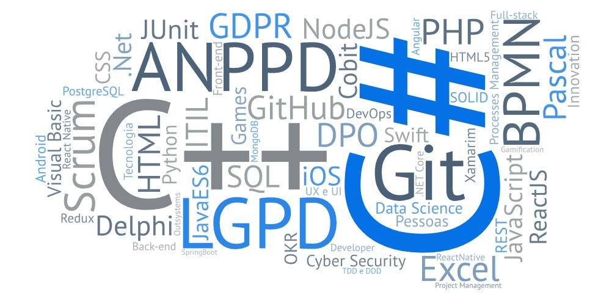

### 👋 Oi, sou o Pleiterson

Possuo 8 anos de experiência em redução de índices de Fraudes, Prevenção de Perdas, Gerenciamento de Riscos, Análise e elaboração de planos de ação nos controles preventivos e Auditoria Interna. Responsável também pelo mapeamento de Processos de Negócios da Segurança Corporativa da [AeC](https://www.aec.com.br/).

Sou certificado em Scrum, [SFC](https://c46e136a583f7e334124-ac22991740ab4ff17e21daf2ed577041.ssl.cf1.rackcdn.com/Certificate/ScrumFundamentalsCertified-PleitersonAmorim-779075.pdf) pela SCRUMStudy e, [SFPC](https://certiprof.com/pages/successful-candidates-register) pela CertiProf. Tenho conhecimentos em BPMN. Estudando LGPD, onde almejo obter as certificações da Exin, desde Segurança da Informação até o DPO.

Atualmente sou membro da Associação Nacional dos Profissionais de Privacidade de Dados, a [ANPPD](https://anppd.org/).

- Estudante de Sistemas de Informação na PUCMinas. Amo novas tecnologias de desenvolvimento;
- Tenho conhecimentos acadêmicos em Pascal, Visual Basic, Delphi, C++, C# e SQL;
- Estudando novas linguagens de programação: JavaScript, Node.JS, React.JS, Java ES6, Git, Python, PHP, etc...

Visite meu LinkedIn e meu canal no Youtube (em evolução) no link acima. Veja também a nuvem de palavras acima com alguns de meus conhecimentos, ou nos quais estou estudando.

### 👨‍💻 Projetos realizados:
- [A Bruxa Hipsta](https://editor.p5js.org/pleiterson/embed/1RMkKmkOm). [Repositório](https://github.com/Pleiterson/Alura-ImersaoGameDev-JavaScript)
- [PleiFlix](https://pleiflix.vercel.app). [Repositório](https://github.com/Pleiterson/Alura-ImersaoReactJS-pleiflix)
- [Proffy](https://proffydiscovery-theta.vercel.app). [Repositório](https://github.com/Pleiterson/rocketseat-NLW2-discovery-Proffy)

#### 🔍 Fun facts:
- Nerd 😄. Louco com games, livros, quadrinhos, animes, músicas, teatro, cinema, bikes;
- Amo minha família. Ensinando os primeiros passos no mundo nerd e na programação ao meu padawan [Hugo Costa](https://github.com/hugocsantos);
- Siga-me na Xbox Live @pleiterson

<!--
**Pleiterson/Pleiterson** is a ✨ _special_ ✨ repository because its `README.md` (this file) appears on your GitHub profile.

Here are some ideas to get you started:

- 🔭 I’m currently working on ...
- 🌱 I’m currently learning ...
- 👯 I’m looking to collaborate on ...
- 🤔 I’m looking for help with ...
- 💬 Ask me about ...
- 📫 How to reach me: ...
- 😄 Pronouns: ...
-->
