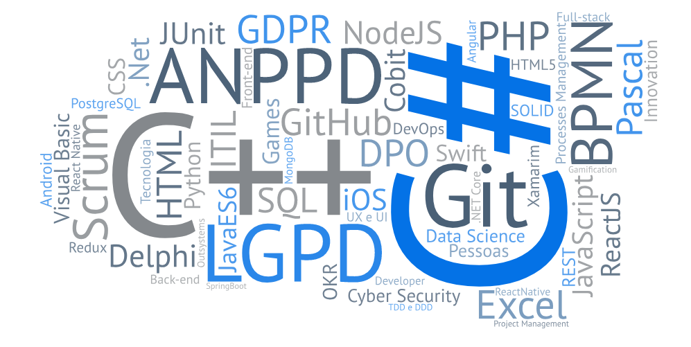
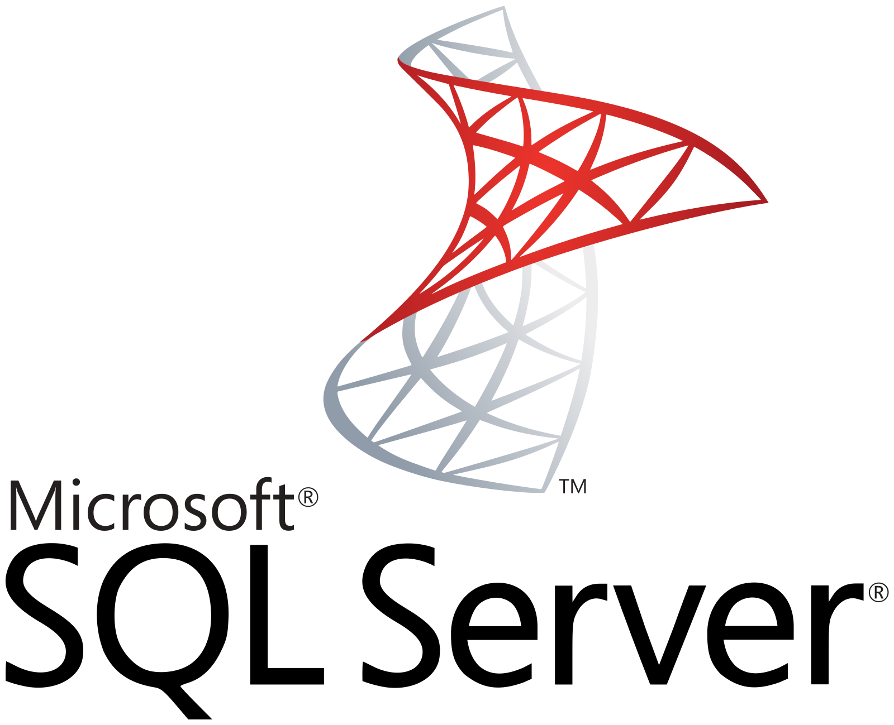

<!--Banner session-->

 
<!-- Badges session -->

<!--About session-->
<h1 align="center">👋 Hi, I'm Pleiterson 💻 👍 Welcome to my GitHub 😁</h1>

<!--

 -->

Possuo 8 anos de experiência em redução de índices de Fraudes, Prevenção de Perdas, Gerenciamento de Riscos, Análise e elaboração de planos de ação nos controles preventivos e Auditoria Interna. Responsável também pelo mapeamento de Processos de Negócios da Segurança Corporativa da AeC.

- Certificado em Scrum, [SFC](https://c46e136a583f7e334124-ac22991740ab4ff17e21daf2ed577041.ssl.cf1.rackcdn.com/Certificate/ScrumFundamentalsCertified-PleitersonAmorim-779075.pdf) pela SCRUMStudy e, [SFPC](https://certiprof.com/pages/successful-candidates-register) pela CertiProf.
- Estudando LGPD, onde almejo obter as certificações da Exin, desde Segurança da Informação até o DPO.

Atualmente sou membro da Associação Nacional dos Profissionais de Privacidade de Dados, a [ANPPD](https://anppd.org/).

- Estudante de Sistemas de Informação na PUCMinas. Amo novas tecnologias de desenvolvimento;
- Conhecimentos em: Pascal,

- Estudando novas linguagens de programação:

<b>Visite meu LinkedIn e meu canal no Youtube <i>(em evolução)</i></b>.

<h3>👨‍💻 Projetos realizados:</h3>

- [A Bruxa Hipsta](https://editor.p5js.org/pleiterson/embed/1RMkKmkOm) | 
- [PleiFlix](https://pleiflix.vercel.app) | 
- [Proffy](https://proffydiscovery-theta.vercel.app) | 

<h3>🔍 Fun facts:</h3>

- Nerd, louco com cachorros (🐕), games (🎮), livros (📚), quadrinhos, animes, músicas (🎼), teatro (🎭), cinema (🎬), bikes (🚵‍♂️);
- Amo minha família (). Ensinando os primeiros passos no mundo nerd e na programação ao meu padawan [Hugo Costa](https://github.com/hugocsantos);

- Follow me in the Xbox community: @pleiterson

<!--
**Pleiterson/Pleiterson** is a ✨ _special_ ✨ repository because its `README.md` (this file) appears on your GitHub profile.

Here are some ideas to get you started:

- 🔭 I’m currently working on ...
- 🌱 I’m currently learning ...
- 👯 I’m looking to collaborate on ...
- 🤔 I’m looking for help with ...
- 💬 Ask me about ...
- 📫 How to reach me: ...
- 😄 Pronouns: ...
-->